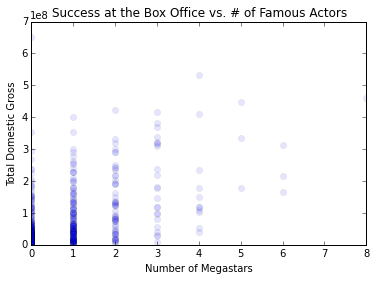
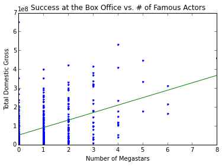

# First pass at product

My main question: How much does it benefit your summer blockbuster to have N different superstars in it?

Here, I plotted the total domestic gross (TDG) of 500 summer blockbusters from the past ten years, and plotted them against the number of "superstars" they feature. To get the list of movies, I took the top 50 movies from each year that came out between the first week of May and Labor Day weekend. To get the list of actors, I took a list of the 100 actors whose films had the highest average TDG, and who had additionally been in more than 10 films.

Below is the result of an ordinary least squares linear regression on this data.

The major drawback of this approach is that the lone feature is a discrete variable with a small range, and the target values are essentially continuous. I am currently developing more continuous features to train my model on.

Another major drawback of this approach is that it relies partially on metrics for measuring an actor's star power that are directly drawn from the films we're trying to model. To fix this, I will only be considering movies from 2010 and earlier as contributions to a star's power, and only considering movies from 2011-present in my model.